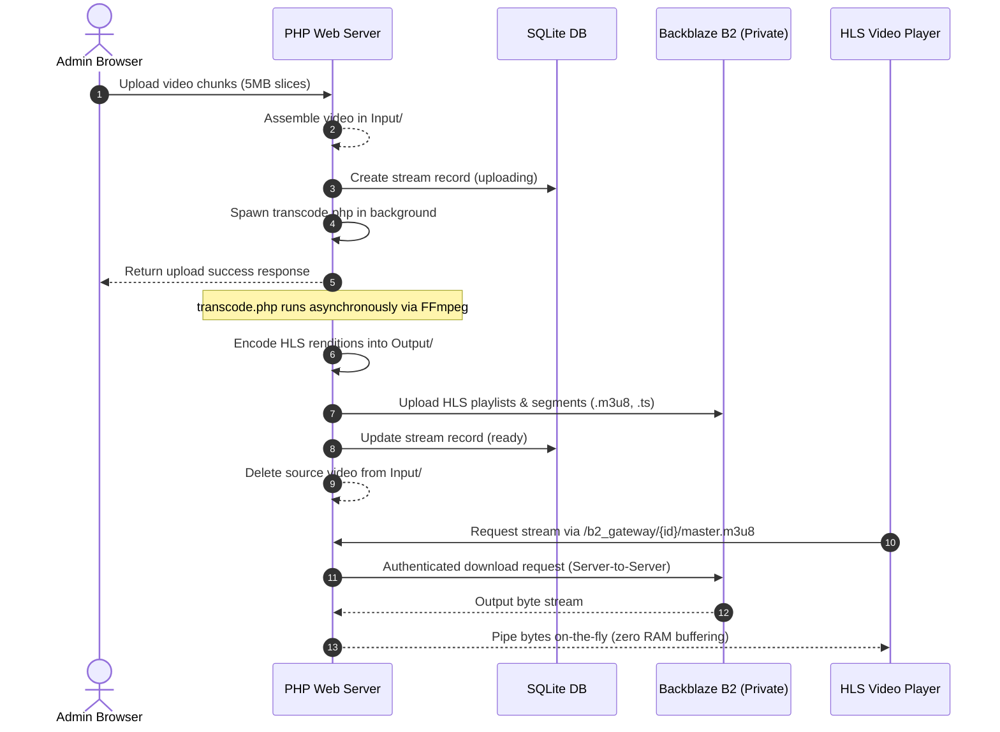

# Zenith Stream Engine

Zenith Stream Engine is a highly optimized, custom-engineered Vanilla PHP + FFmpeg video hosting, transcoding, and streaming platform. It features multi-resolution HLS encoding, SQLite data persistence, VAST/VPAID ad scheduling, and a secure server-to-server Backblaze B2 proxy gateway that hides your cloud storage credentials and endpoints completely.

---

## Key Features

- **Private Cloud Security (Local Proxy Gateway):** Routes all HLS playlist and segment requests through a high-performance PHP proxy. Hides bucket names, regions, and access keys from the public client, preventing hotlinking.
- **Zero-Memory Streaming:** Streams binary video slices directly from Backblaze B2 using buffered chunk output with `flush()` and custom cURL write hooks, keeping RAM overhead at zero.
- **High-Performance Fallback:** Automatically falls back to local disk storage if Backblaze B2 is offline or if a segment has not yet finished uploading to the cloud.
- **Chunked Ingestion:** Drag-and-drop ingestion interface slicing massive videos into 5MB chunks to bypass PHP post size boundaries and timeout limits.
- **Asynchronous HLS Transcoding:** Spawns a background CLI worker generating multi-resolution HLS targets (`1080p`, `720p`, `540p`, `480p`, `360p`) and standard adaptive master playlists (`.m3u8` + `.ts`).
- **VAST/VPAID Ad Manager:** Dashboard campaign scheduler supporting pre/mid/post-roll triggers based on custom offsets (seconds, percentage, timestamps).
- **Clean URLs:** Extensionless routing deck (`index`, `settings`, `upload`, `ads`, `api`, `stream`, `b2_gateway`) configured for both Apache (`.htaccess`) and PHP built-in dev servers.

---

## System Requirements

Ensure your hosting environment meets the following specifications:

- **PHP Version:** PHP 8.0+
- **PHP Extensions:**
  - `pdo_sqlite` (for database persistence)
  - `curl` (mandatory for server-to-server Backblaze B2 API requests)
  - `openssl` / `mbstring` (for secure session handling)
- **CLI Binaries (Must be in system PATH):**
  - **FFmpeg**: Required for HLS transcoding
  - **FFprobe**: Required for video metadata parsing and telemetry
- **Web Server (Optional for Production):** Apache HTTP Server with `mod_rewrite` enabled (uses the configured `.htaccess`).
- **Cloud Storage (Optional):** Backblaze B2 account (Private bucket).

Verify your binaries are accessible:
```bash
php -v
ffmpeg -version
ffprobe -version
```

---

## File Structure & Routing Map

- `index.php` — Bootstraps the layout engine and runs the dashboard sections (Registry, Ingestion, Ads). Includes the local dev server router bridge.
- `login.php` & `logout.php` — Administrative session validation portals.
- `auth.php` — Session guard that validates administrative credentials using BCRYPT.
- `api.php` — REST API handling CRUD settings, chunk uploads, and stream deletions.
- `layout.php` — Base view layout shell, navigation tab handlers, and global assets imports.
- `stream.php` — Branded HLS video player incorporating the custom-skinned UI and Google IMA SDK.
- `b2.php` — Backblaze B2 API client wrapping authentication, uploads, and chunk downloads.
- `b2_gateway.php` — Path-based proxy stream gateway translating `/b2_gateway/{streamId}/{file}` requests.
- `transcode.php` — Asynchronous CLI transcoding script.
- `database.sqlite` — Database file containing streams metadata, ad campaigns, and credentials.
- `Input/` & `Output/` — Storage directories for temporary ingestion chunks and finalized streams.
- `.htaccess` — Apache rewrite rules managing clean URLs and canonical redirects.

---

## How to Connect to Backblaze B2

Connecting your Stream Engine to Backblaze B2 takes place entirely in the Admin Console. The credentials are encrypted at rest inside SQLite and are never exposed to the client.

### Step 1: Create a Private Bucket
1. Log in to your [Backblaze Account](https://www.backblaze.com/b2/cloud-storage.html).
2. Go to **Buckets** -> **Create a Bucket**.
3. Choose a bucket name (e.g. `your-stream-bucket`).
4. Set the Bucket Type to **Private** (Crucial: This blocks direct public hotlinking of your files).
5. Click **Create a Bucket**. Note down your **Bucket Name** and **Bucket ID**.

### Step 2: Generate Application Keys
1. Go to **App Keys** under the account settings sidebar.
2. Click **Add a New Application Key**.
3. Give it a name (e.g., `zenith-stream-key`).
4. Set permissions to **Read and Write** (needed to upload transcode output).
5. Click **Create New Key**. 
6. **IMPORTANT:** Instantly copy the **keyID** and **applicationKey** (these will only be shown once).

### Step 3: Enter Credentials in Settings
1. Boot your Stream Engine and navigate to `/settings`.
2. Enter your credentials under the **Backblaze Cloud Storage Connection** panel:
   - **B2 Key ID**: Paste the `keyID` you generated.
   - **B2 Application Key**: Paste the `applicationKey` value.
   - **B2 Bucket ID**: Paste the bucket ID.
   - **B2 Bucket Name**: Paste the bucket name.
3. Click **Save Configuration**.

---

## Ingestion & Storage Architecture



---

## Running Locally

### 1. Start Web Server
You can run the site locally using PHP's built-in web server. From the project root folder:
```powershell
php -S 127.0.0.1:8080
```
Open your browser and navigate to the clean index route:
```text
http://127.0.0.1:8080/index
```

### 2. Administrative Authentication (How to Log In)
To prevent unauthorized configuration changes and ingestion, the Stream Engine Console is protected by secure session validation:
- **Default Username:** `admin`
- **Default Password:** `admin123`

When visiting any dashboard page (like `/index`, `/settings`, `/upload`, or `/ads`), you will be automatically redirected to `/login` if your session is unauthenticated.

#### Changing the Administrator Password:
1. Log in using the default credentials.
2. Navigate to `/settings` (System Settings tab).
3. Under the **Security & Session Controls** card, enter your current password, type your new password, and click **Update Password**.
4. The password hash is securely encrypted inside SQLite using **BCRYPT** hashing.

### 3. Apache Production Deployment
If deploying to Apache, ensure `AllowOverride All` is set in your Apache directory configuration so that `.htaccess` is processed. This enables clean URLs automatically.
- Navigate to `http://yourdomain.com/index` to access the console.
- Video players will load manifests cleanly via `http://yourdomain.com/b2_gateway/{stream_id}/master.m3u8`.
