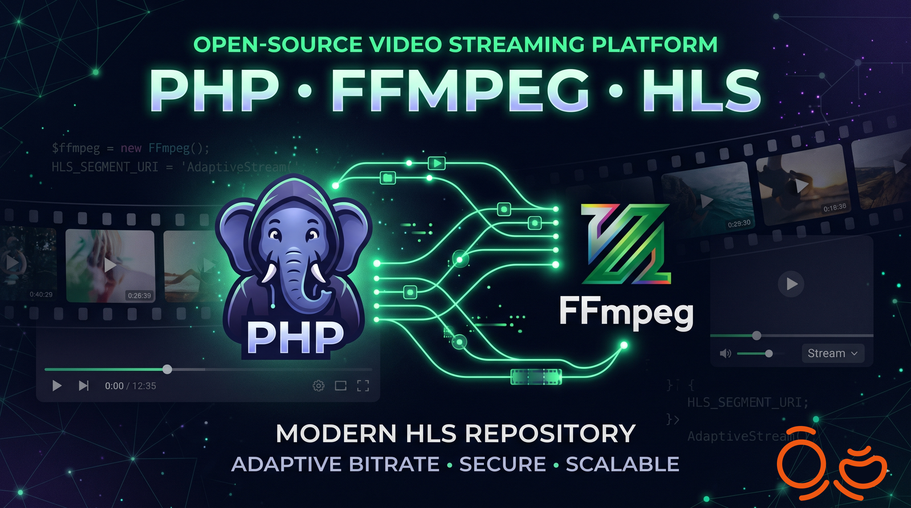

# StreamingScript

StreamingScript is a lightweight PHP + FFmpeg backend that converts uploaded videos into HLS and serves an embeddable player URL.

## Features

- Upload a video file from browser or API.
- Transcode to 720p HLS (`master.m3u8` + `.ts` segments).
- Detect source codec using `ffprobe`.
- Save stream metadata in `streams.json`.
- Provide an iframe-ready player endpoint.

## Project Structure

```text
stream.php      Main app (routing, upload, transcoding, APIs, player page)
streams.json    Stream registry
Input/          Temporary uploaded files
Output/         Generated HLS output by stream id
```

## Requirements

- PHP 8.0+
- FFmpeg in system PATH
- FFprobe in system PATH

Verify installation:

```powershell
php -v
ffmpeg -version
ffprobe -version
```

## Run Locally

From the project directory:

```powershell
php -S 127.0.0.1:8800
```

Open in browser:

```text
http://127.0.0.1:8800/stream.php
```

## Endpoints

### Upload video

- Method: `POST`
- URL: `/stream.php?action=upload`
- Content-Type: `multipart/form-data`
- Field name: `video`

Example:

```powershell
curl.exe -X POST "http://127.0.0.1:8800/stream.php?action=upload" ^
  -F "video=@C:/path/to/video.mp4"
```

Response includes `id`, `hls_url`, and `iframe_url`.

### List streams

- Method: `GET`
- URL: `/stream.php?action=list`

Example:

```powershell
curl.exe "http://127.0.0.1:8800/stream.php?action=list"
```

### Player page

- Method: `GET`
- URL: `/stream.php?action=player&id={stream_id}`

Iframe example:

```html
<iframe
  src="http://127.0.0.1:8800/stream.php?action=player&id=YOUR_STREAM_ID"
  width="960"
  height="540"
  allowfullscreen
></iframe>
```

## Processing Flow

1. Client uploads a video.
2. Server validates extension and moves file to `Input/`.
3. `ffprobe` reads video codec.
4. `ffmpeg` transcodes video to 720p HLS in `Output/{id}/`.
5. Stream metadata is appended to `streams.json`.
6. Temporary input file is removed after successful processing.

## streams.json Format

```json
{
  "items": [
    {
      "id": "abc123...",
      "title": "video.mp4",
      "created_at": "2026-05-29T00:00:00+00:00",
      "status": "ready",
      "video_codec": "h264",
      "direct_codec_supported": true,
      "hls_url": "http://127.0.0.1:8800/Output/abc123.../master.m3u8",
      "iframe_url": "http://127.0.0.1:8800/stream.php?action=player&id=abc123..."
    }
  ]
}
```

## Troubleshooting

- Upload fails:
  Check PHP limits in `php.ini` (`upload_max_filesize`, `post_max_size`, `max_execution_time`).
- FFmpeg processing fails:
  Ensure `ffmpeg` and `ffprobe` are installed and available in PATH.
- Player does not play:
  Confirm generated files exist in `Output/{id}` and are reachable by URL.
- Empty list response:
  Ensure `streams.json` exists and is writable.

## Notes

- This project is a prototype and uses extension-based upload validation.
- For production, add authentication, stricter file validation, rate limiting, async job queue, and monitoring.
